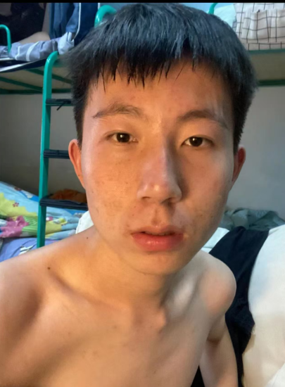
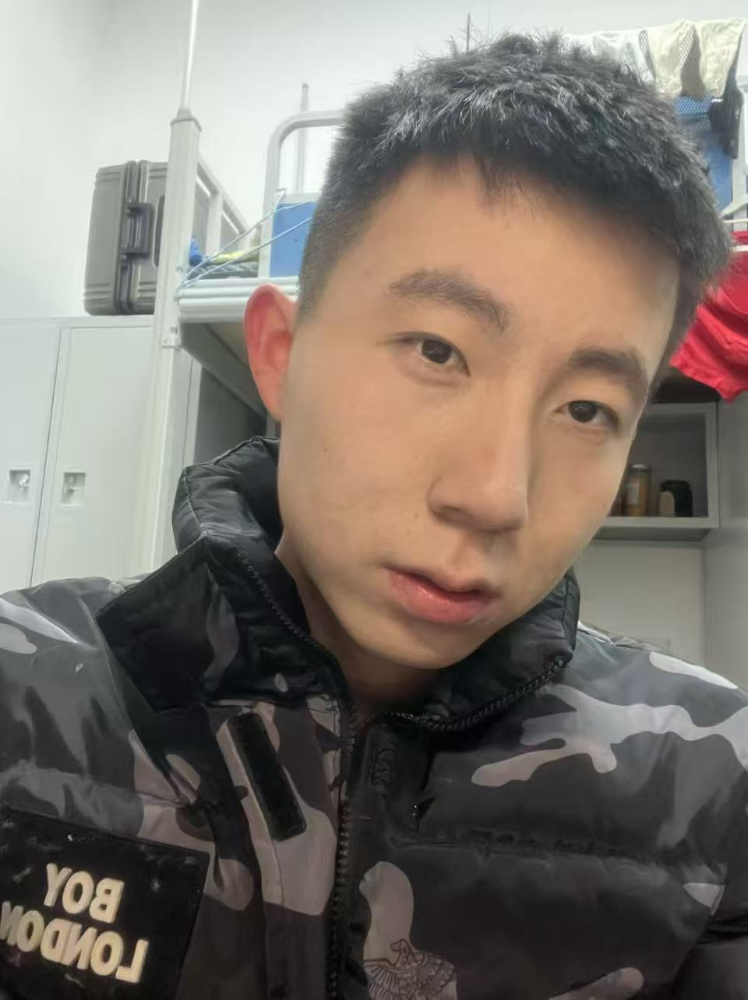
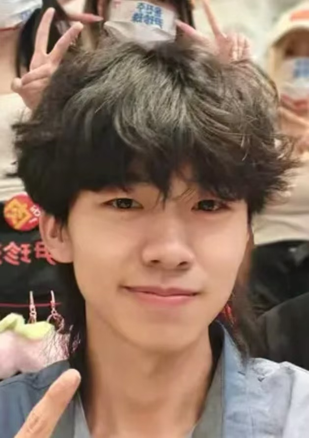
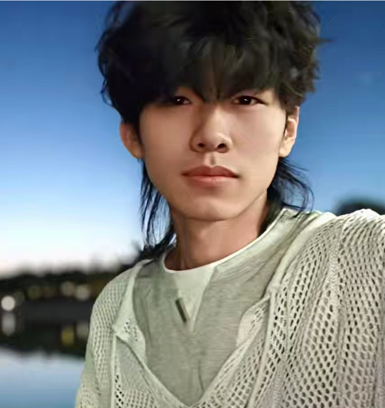
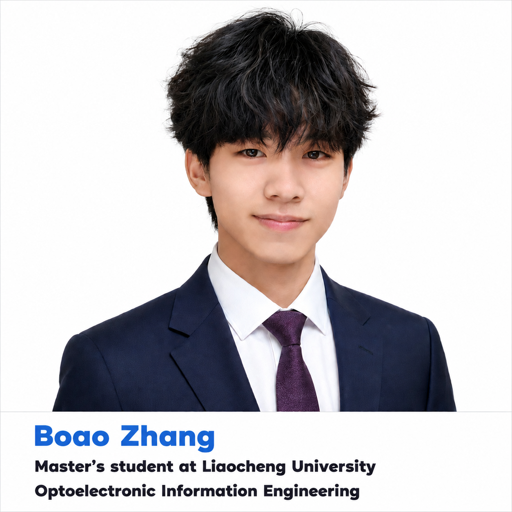
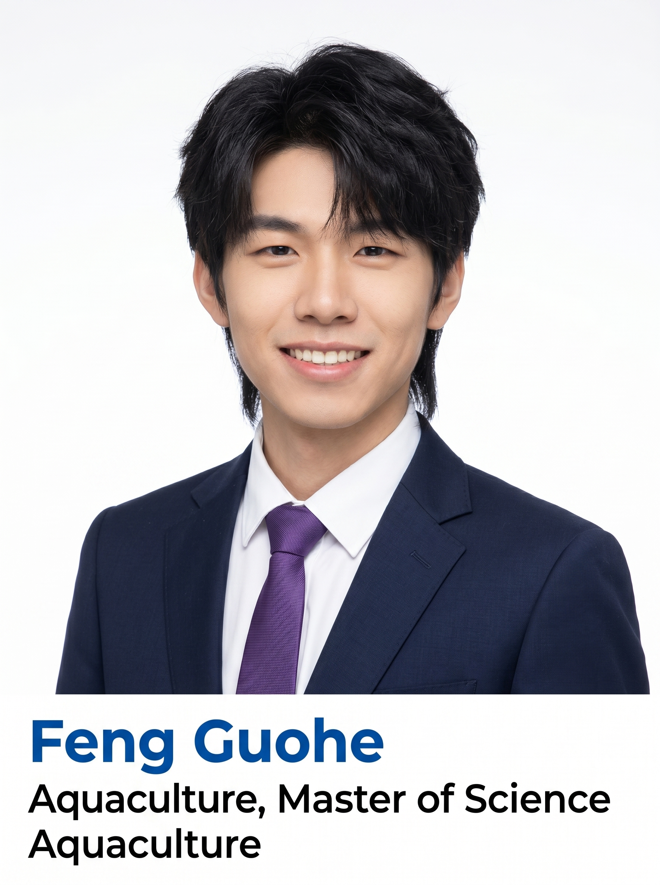

# Preferential CN AI Photo Prompts

偏向中国用户的 AI 照片提示词收藏。  
Chinese-focused AI photo prompt collection.

这个仓库的用法很简单：先展示原始照片，再展示精修后的效果图，最后把对应提示词放在图片下面，方便直接复制使用。

## 示例 001：商务人像精修

陆抖爆火的商务头像风格，把普通自拍改成高端商务形象照。

### 注意事项

1. 修改原始照片类的提示词，建议优先使用 Gemini。实测 Gemini 的 Nano-Banana 模型对人物面部识别度较高，生成图片更容易保留本人特征。
2. 人像类生图建议上传 3 到 10 张素材，包括不同角度、不同表情、不同光线的照片。素材有限时，可以多生成几次，提高面部识别度。
3. 为了避免生成图尺寸参差不齐，建议在提示词里写清楚画幅和分辨率，例如：竖版 3:4、竖版 4:5、方形 1:1、横版 16:9、竖版 9:16。常用分辨率可以写 1024x1024、1080x1440、1080x1920。
4. 示例 002 里面含有带字体的图片，可以先挑选想要的字体发给 AI，然后再生成。

### 原始素材

| V1 | V2 |
| --- | --- |
|  |  |

### 精修效果图

| ChatGPT 版本 | Gemini 版本 |
| --- | --- |
|  |  |

### 中文提示词

```text
将上传的人像转换为美式专业商务头像风格，同时保留人物原有的面部特征与身份辨识度。要求：半身肖像、蓝色纹理摄影棚背景、柔和自然的棚拍灯光、高分辨率清晰度、真实自然的肤色表现，以及干净优雅的画面构图。人物应穿着商务休闲衬衫，搭配简约精致的领带，整体设计现代、专业且具有高级感。

表情应自然放松、自信亲和，眼神明亮有神，并带有真诚自然的微笑。面部保持清晰锐利对焦，背景略微虚化以增强空间层次感，整体效果精致、专业且具有高端商业摄影质感。

建议画幅：竖版 3:4 或 4:5。
建议分辨率：不低于 1024x1365，或使用 1080x1440。
```

### English Prompt

```text
Transform the uploaded portrait into an American-style professional business headshot while preserving the person's original facial features and identity. The image should be a half-body portrait with a blue textured studio background, soft natural studio lighting, high-resolution clarity, realistic skin tones, and a clean elegant composition. The person should wear a business-casual shirt with a simple refined tie, creating a modern, professional, and premium look.

The expression should be relaxed, confident, approachable, and natural, with bright focused eyes and a sincere smile. Keep the face sharply in focus, slightly blur the background to create depth, and make the final result look polished, professional, and high-end commercial photography.

Recommended aspect ratio: vertical 3:4 or 4:5.
Recommended resolution: at least 1024x1365, or 1080x1440.
```

### 负面提示词

```text
负面提示词为 AI 自动生成，可选，但是没有必要。
低清晰度，模糊，脸部变形，五官变化过大，不像本人，皮肤过度磨皮，塑料质感，手指错误，多余手指，文字，水印，logo，过曝，欠曝
```

---

## 示例 002：学生人像精修

适合生成学生证件风、学术介绍页、研究生/大专生个人展示图。这个示例包含底部文字信息区，生成前需要把姓名、专业、学历等占位内容替换成真实信息。

### 注意事项

1. 使用此提示词时，要告诉 AI：你的专业、姓名、学历层次，例如研究生、大专生、本科生等。
2. 提示词里有 `YourName`、`Your Department And Your Degree`、`Your Major` 这类占位内容，生成前需要替换。
3. 这类图片包含文字，建议先把你想要的字体或参考图发给 AI，再让 AI 生成，文字排版会更稳定。

### 原始素材

| V1 | V2 |
| --- | --- |
|  |  |

### 精修效果图

| ChatGPT 版本 | Gemini 版本 | Gemini V2 版本 |
| --- | --- | --- |
|  |  |  |

### 中文提示词

```text
使用提供的用户照片作为面部特征参考，在提升肖像质量的同时，保留真实的人类面部细节。

创作一张精致、专业的东亚裔男性/女性行政人员肖像。拍摄对象穿着深海军蓝商务西装、挺括的白色衬衫、深紫色领带。表情需自信、平易近人、专业且自然。

背景必须为纯净的白色摄影棚背景，不得包含任何渐变、纹理、阴影、图案或环境元素。保持高分辨率的画面锐度及真实的皮肤质感渲染。图像应呈现出如专业摄影棚拍摄的优质 LinkedIn 头像或企业高管肖像风格。

底部文字布局需要严格 1:1 复刻参考图。完全复刻参考图中底部信息区域的布局、间距、对齐方式、字体层级、比例及定位。在图像底部添加一个纯白色横条区域，所有文字必须完整保留在横条边界内。

文字内容：
第 1 行：左对齐蓝色文字 "YourName"，匹配参考图中 "Customer" 一词的字体样式、字重、字号、颜色和定位。
第 2 行：紧接第 1 行下方，左对齐黑色文字 "Your Department And Your Degree"，匹配参考图中对应位置的字体样式、字号、间距和颜色。
第 3 行：紧接第 2 行下方，左对齐黑色文字 "Your Major"，匹配参考图中 "Your Major" 这一短语的排版和对齐方式。

确保整体肖像构图平衡、具有行政专业感，并达到可发布标准。
```

### English Prompt

```text
Use the provided user photo as the facial identity reference. Improve portrait quality while retaining realistic human facial details.

Create a polished professional portrait of an East Asian male/female executive. The subject should wear a dark navy blue business suit, a crisp white dress shirt, and a deep purple tie. The expression should be confident, approachable, professional, and natural.

The background must be a clean pure white studio background with no gradients, textures, shadows, patterns, or environmental elements. Maintain high-resolution photographic sharpness and realistic skin rendering. The image should resemble a premium LinkedIn or corporate executive headshot photographed in a professional studio.

Replicate the bottom information area from the reference image exactly in layout, spacing, alignment, typography hierarchy, proportions, and positioning. Add a solid white banner section at the bottom of the image. All text must remain fully inside the banner boundaries. Maintain identical padding, margins, line spacing, and text hierarchy.

Text content:
Line 1: left-aligned blue text "YourName", matching the exact font style, font weight, font size, color, and positioning of the word "Customer" in the reference image.
Line 2: left-aligned black text directly below Line 1: "Your Department And Your Degree", matching the exact font style, font size, spacing, and color from the reference image.
Line 3: left-aligned black text directly below Line 2: "Your Major", matching the exact typography and alignment of the phrase "Your Major".

Ensure the portrait composition looks balanced, executive, and publication-ready.
```

### 负面提示词

```text
低清晰度，模糊，脸部变形，不像本人，文字溢出，文字乱码，字体错位，底部横条变形，排版不齐，水印，logo，过曝，欠曝
```

---

## 新增一组图片的方法

1. 把原图放到 `images/` 文件夹。
2. 把生成后的效果图也放到 `images/` 文件夹。
3. 在 `README.md` 里按下面格式新增一组。

````markdown
## 示例 003：这里写标题

一句话说明这个提示词适合什么场景。

### 注意事项

1. 这里写使用提醒。
2. 这里写需要替换的信息。

### 原始素材


### 精修效果图


### 中文提示词

```text
这里写中文提示词。
```

### English Prompt

```text
Write the English prompt here.
```

### 负面提示词

```text
低清晰度，模糊，脸部变形，不像本人，文字，水印，logo
```
````

## 图片显示尺寸建议

GitHub Markdown 可以用 HTML 控制图片显示尺寸：

```html

```

推荐宽度：

- 单张大图：`width="360"`
- 两张对比图并排：`width="320"`
- 三张版本图并排：`width="240"`

