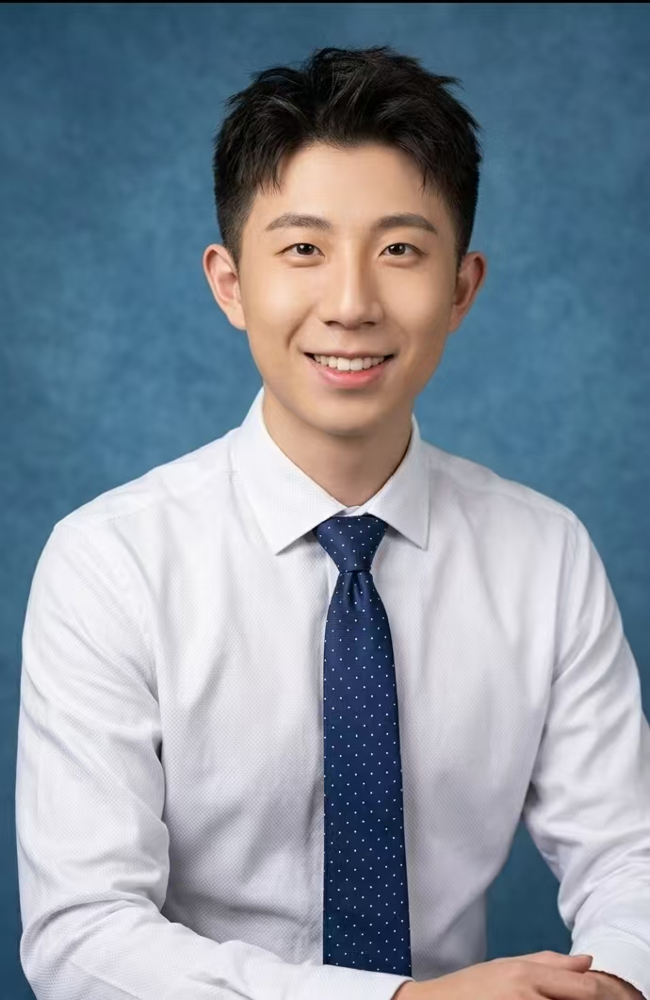

# Preferential CN AI Photo Prompts

偏向中国用户的 AI 照片提示词收藏。  
Chinese-focused AI photo prompt collection.

这个仓库的用法很简单：先展示原始照片，再展示精修后的效果图，最后把对应提示词放在图片下面，方便直接复制使用。

## 示例 001：商务人像精修

陆抖爆火的商务头像风格，把普通自拍改成高端商务形象照。

### 注意事项

1. 修改原始照片类的提示词，建议优先使用 Gemini。实测 Gemini 的 Nano-Banana 模型对人物面部识别度较高，生成图片更容易保留本人特征。
2. 人像类生图建议上传 3 到 10 张素材，包括不同角度、不同表情、不同光线的照片。素材有限时，可以多生成几次，提高面部识别度。
3. 为了避免生成图尺寸参差不齐，建议在提示词里写清楚画幅和分辨率，例如：竖版 3:4、竖版 4:5、方形 1:1、横版 16:9、竖版 9:16。常用分辨率可以写 1024x1024、1080x1440、1080x1920。

### 原始素材

| V1 | V2 |
| --- | --- |
|  |  |

### 精修效果图

| ChatGPT 版本 | Gemini 版本 |
| --- | --- |
|  |  |

### 中文提示词

```text
将上传的人像转换为美式专业商务头像风格，同时保留人物原有的面部特征与身份辨识度。要求：半身肖像、蓝色纹理摄影棚背景、柔和自然的棚拍灯光、高分辨率清晰度、真实自然的肤色表现，以及干净优雅的画面构图。人物应穿着商务休闲衬衫，搭配简约精致的领带，整体设计现代、专业且具有高级感。

表情应自然放松、自信亲和，眼神明亮有神，并带有真诚自然的微笑。面部保持清晰锐利对焦，背景略微虚化以增强空间层次感，整体效果精致、专业且具有高端商业摄影质感。

建议画幅：竖版 3:4 或 4:5。
建议分辨率：不低于 1024x1365，或使用 1080x1440。
```

### English Prompt

```text
Transform the uploaded portrait into an American-style professional business headshot while preserving the person's original facial features and identity. The image should be a half-body portrait with a blue textured studio background, soft natural studio lighting, high-resolution clarity, realistic skin tones, and a clean elegant composition. The person should wear a business-casual shirt with a simple refined tie, creating a modern, professional, and premium look.

The expression should be relaxed, confident, approachable, and natural, with bright focused eyes and a sincere smile. Keep the face sharply in focus, slightly blur the background to create depth, and make the final result look polished, professional, and high-end commercial photography.

Recommended aspect ratio: vertical 3:4 or 4:5.
Recommended resolution: at least 1024x1365, or 1080x1440.
```

### 负面提示词

```text
低清晰度，模糊，脸部变形，五官变化过大，不像本人，皮肤过度磨皮，塑料质感，手指错误，多余手指，文字，水印，logo，过曝，欠曝
```

---

## 新增一组图片的方法

1. 把原图放到 `images/` 文件夹。
2. 把生成后的效果图也放到 `images/` 文件夹。
3. 在 `README.md` 里按下面格式新增一组。

````markdown
## 示例 002：这里写标题

### 原始素材


### 精修效果


### 中文提示词

```text
这里写中文提示词。
```

### English Prompt

```text
Write the English prompt here.
```

### 负面提示词

```text
低清晰度，模糊，脸部变形，不像本人，文字，水印，logo
```
````

## 图片显示尺寸建议

GitHub Markdown 可以用 HTML 控制图片显示尺寸：

```html

```

推荐宽度：

- 单张大图：`width="360"`
- 两张对比图并排：`width="320"`
- 三张版本图并排：`width="240"`

